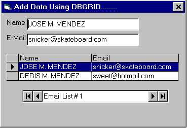

## DataBase using DbGrid, MSFlexGrid,TextBox, ComboBox, Etc\.\.

### Description

THIS IS AN EXAMPLE OF HOW YOU CAN DO A SIMPLE TABLE WITH DATA, SO YOU CAN NOT USE THE FREEFILE() , YOU CAN MAKE MSFLEX GRID, TEXT BOX,COMBO BOX ETC WITH THIS CODE, AND IS SO EASY, TRY IT, PLEASE DONT FORGET TO VOTE FOR ME THANKS.....
 
### More Info
 
THIS IS AN EXAMPLE OF THE NAME OF YOUR FRIEND AND EMAIL , but you can view in the text box the data and somo other things

             |
---                |---
**Submitted On**   |2001-07-21 22:39:34
**By**             |[Jose Manuel Mendez](https://github.com/Planet-Source-Code/PSCIndex/blob/master/ByAuthor/jose-manuel-mendez.md)
**Level**          |Beginner
**User Rating**    |3.7 (48 globes from 13 users)
**Compatibility**  |VB 3\.0, VB 4\.0 \(16\-bit\), VB 4\.0 \(32\-bit\), VB 5\.0, VB 6\.0, VB Script, ASP \(Active Server Pages\) , VBA MS Access, VBA MS Excel
**Category**       |[Databases/ Data Access/ DAO/ ADO](https://github.com/Planet-Source-Code/PSCIndex/blob/master/ByCategory/databases-data-access-dao-ado__1-6.md)
**World**          |[Visual Basic](https://github.com/Planet-Source-Code/PSCIndex/blob/master/ByWorld/visual-basic.md)
**Archive File**   |[DataBase u232337212001\.zip](https://github.com/Planet-Source-Code/jose-manuel-mendez-database-using-dbgrid-msflexgrid-textbox-combobox-etc__1-25311/archive/master.zip)

